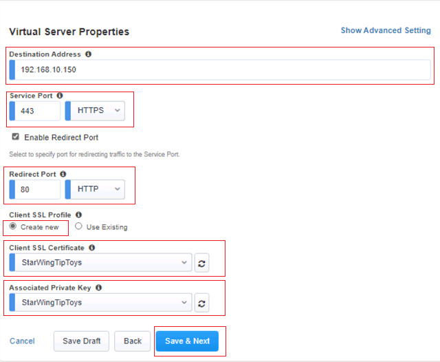
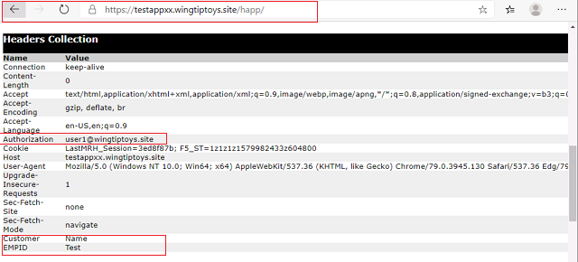
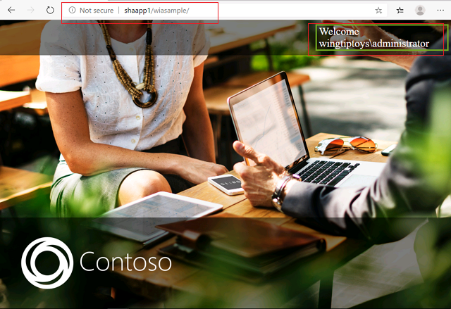
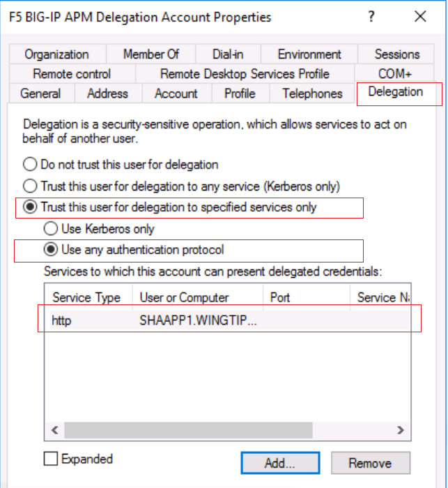
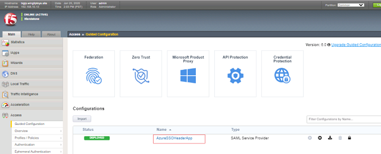
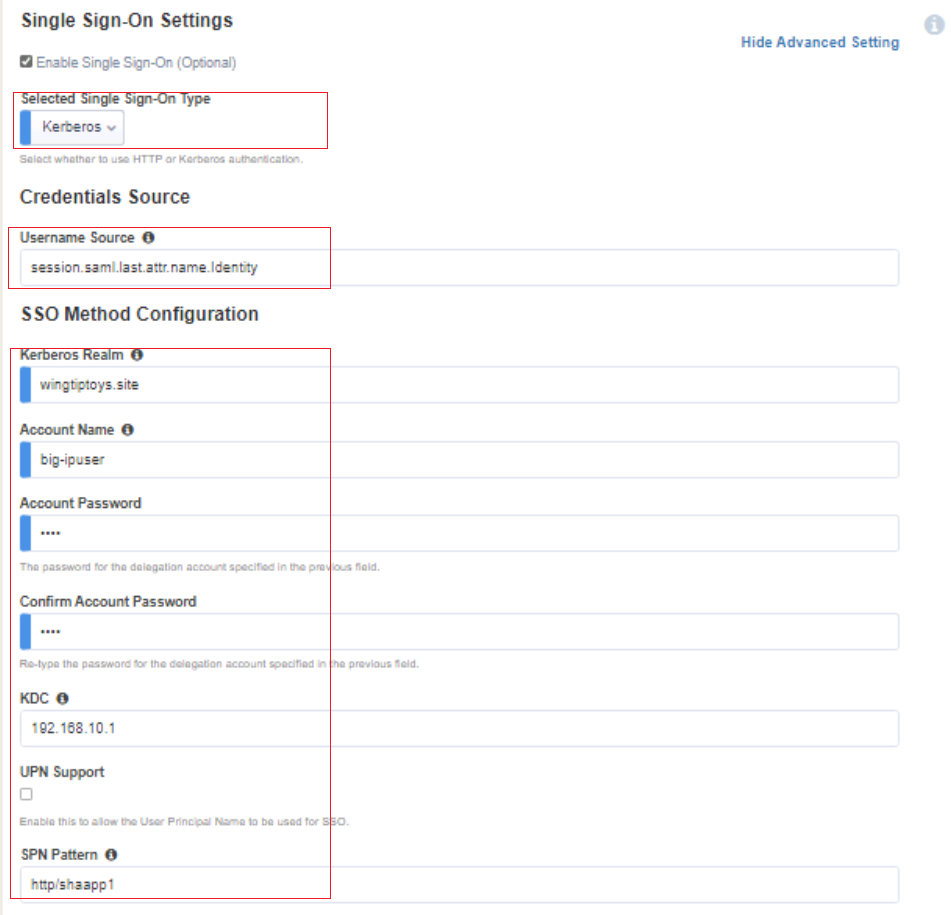
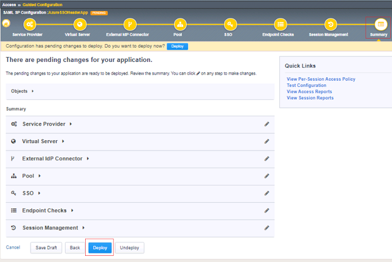
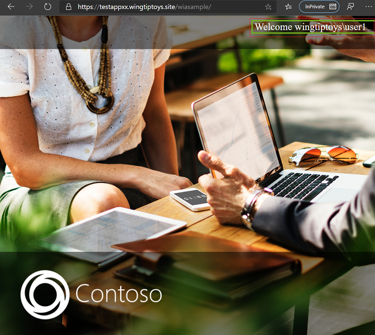

SOME TEXT of the LAB

| Title  | Description | Time Required [120 Mins] |
| :----------| :----------- | :---------- |
| Lab1 | Publish a Header  Based Application with F5 BIG-IP APM and Azure AD | 30 Mins | 
| Lab2 | Publish a Header Based Application with Azure AD Application Proxy | 30 Mins | 
| Lab3 | Publish a Keberos Application with F5 BIG-IP APM and Azure AD | 30 Mins | 
| Lab4 | Publish a Keberos Application with Azure AD Application Proxy | 30 Mins |

# Pre-requisites 

Before we get started with the exercises there are few environment pre-requisites that will need to be installed and setup.

## Install the Web Application Samples

1. Login to **SHAApp1** VM as **wingtiptoys\administrator**
2. Open Windows PowerShell ISE as Administrator
3. Open the Browser and type `https://raw.githubusercontent.com/jeevanbisht/Azure-ActiveDirectory-AppProxy-DemoSuite/master/BootStrap.ps1` in url.
4. Copy the entire script from this URL and paste the contents in previously open powerShell ISE console and execute. This should install the webserver and the sample websites required for the lab.

## Activate BIG-IP License

1. On the **SHADC1** open Egde browser and navigate to `https://192.168.10.13/`
2. Login with username : **admin**  Password : **Hyper#2020**
3. Click **Activate** and type the F5 License Key in the **Base Registration Key** and Click **Next** . Wait for BIG-IP to apply configuration change,  Click **continue**,  Click **Next** 
4. Ensure the **APM Module** is select and click **submit**

# **Lab 1: Publish a Header Based Application with F5 BIG IP APM and Azure AD**
##### **Objective** : 
We will publish a Header Based Application running Internally on the SHAAPP1 Web Server. The application can be accessed internally by using http://shaapp1:90/HeaderApp1

Below are the series of steps required.

 | Step | Description | Time Required [30 Mins] |
 | :----------- | :---------- | :---------- |
| **1** |Identify the public IP Address | 5 Min |
| **2** |Update the Internal and External DNS for the Application | 10 Min |
|**3** |Add Application in the Azure AD | 10 Min |
|**4** |Publish and Configure BIG IP to Authenticate with Azure AD and Create Headers | 10 Min |
|**5** |Verify Application Access Internally | 10 Min |
| **6**| Verify Application Access Externally | 10 Min |

### 1. Identify the public IP Address and update public DNS

We will publish the application externally we need to setup a public hostname name ex `testappxx.wingtiptoys.site` 
1. Goto the **SHADC1** Virtual Machine
2. Open edge browser and type 'https://www.whatsmyip.com' and make a note of public IPV4 Address
3. Open Windows Powershell and open `c:\scripts\UpdatePublicDNS.ps1` update the $Name and $PublicIP
4. Verify the name was updated using NSLOOKUP from your Base Machine

**Result:** You should have a Public DNS Name  `testappXX.wingtiptoys.site`  resolving to you public IP Address

### 2. Update the Internal  DNS for the Application
The Internal request will be routed to F5 BIG-IP in the Virtual IP `192.168.10.150`.
1. Goto the **SHADC1** Virtual Machine
2. Open the **DNS** from the **Server Manager**
3. Create A/HOST  Record for `testappXX` pointing to `192.168.10.150`

**Result:** You should have a Internal DNS Name  `testappXX.wingtiptoys.site` resolving to `192.168.10.150`

### 3. Add Application in the Azure AD

You will   --add text --

1. Goto `https://portal.azure.com` and login as `AppAdmin@wingtiptoys.site` , Password `TRPassword#2020`.
2. Goto the `Azure Active Directory` Blade and Click `Enterprise Applications`
3. Click `+ New Application `
4. Search F5 in `Add from the Gallery` , type `HeaderAppTestXX` in Name and Click `add`

5. Configure **Users and Groups** and Assign **User1 Dem0**

6. Configure Single sign-on and Choose SAML

7. Update the **Entity ID** and **Reply URL** as `https://testappxx.wingtiptoys.site/` and download the **Federation Metadata XML**  File and Save to Desktop (this will be used in the F5 BIG-IP Configuration)

### Publish and Configure BIG IP to Authenticate with Azure AD and Create Headers

* On the **SHADC1** open Egde browser and navigate to `https://192.168.10.13/`
* Login with username : **admin**  Password : **Hyper#2020**

1. Click **Main >> Access >> Guided Configuration >> Fedeartion >> SAML Service Provider**

* Specify the following

  * **Configuration Name :** AzureSSOHeaderApp
  * **Entity ID :** https://testappxx.wingtiptoys.site/
  * **Scheme :** https
  * **Host :** testappxxx.wingtiptoys.site
  * Click **Next**

2. **Virtual Server Configuration**
* Specify the following Configuration

  * **Destination Address :** 192.168.10.150 , This will be the Virtual Server IP for our Application, Public IP address forwarding is configured to forward traffic to this IP on the firewall.
  * **Service Port :** 443 / HTTPS  : Externally exposed as HTTPS
  * **Redirect Port :** 80 / HTTP   : Internally running as HTTP
  * **Create new** Client SSL Profile
  * select **StarWingTipToys** under **Client SSL Certificate** and **Associated Private Key**. The WildCard Certificate and Key is already uploaded in the F5 BIG-IP Appliance
  * Click **Save and Next**

3. **External Identity Provider Connector Settings**
* Specify the following Configuration
  * Specify **Metadata** under methods
  * Specify the **Federation Metadata XML** downloaded and saved to Desktop earlier during Azure AD configuration
  * Specify a Name ex. **AzureSSOSAMLIDP**
  * Click **Save and Next**

  
4. **Pool Properties**
* Specify the following Configuration
  * Specify **Create New** under select a Pool
  * Specify **Round Robin** under Load Balancing Method
  * Specify **192.168.10.11** under Node Name and **80** under Port. This is will where the application is running.
  * Click **Save and Next**

5. **Single Sign-On Settings**
* Specify the following Configuration
  * Specify **HTTP header-based** under single sign-on Type
  * We will add some HTTP Headers for our testing
    * Add Operation **replace** specify **customer** as HeaderName and **Jeevan** as HeaderValue
    * Add Operation **replace** specify **EMPID** as HeaderName and **TEST** as HeaderValue
    * Note : The Header Values can also be variables representing information coming from Azure AD SAML Claim.
  * Click **Save and Next**

6. **Endpoint Checks Properties**
* No configuration required
  * Click **Save and Next**

7. ** Timeout Settings**
* No configuration required
  * Click **Save and Next**

8.**Summary**
* Specify the following Configuration
 * Click **Deploy**

### Verify Application Access Internally 
1. Goto the **SHADC1** Virtual Machine
2. Open edge browser **In Private Session** and type `https://testappxx.wingtiptoys.site` 
3. You should see the **Microsoft Login Page**, Login as **user1@wingtiptoys.site** 
4. You should be able to see the On-premise Web Applicaiton publish via F5 BIG-IP
5. Browse to `https://testappxx.wingtiptoys.site/happ` this website simple prints the headers. You will see 3 Headers are Injected by the F5 BIG-IP.

### Verify Application Access Externally 
1. Launch the **In Private Session** from you base computer and type `https://testappxx.wingtiptoys.site` 
3. You should see the **Microsoft Login Page**, Login as **user1@wingtiptoys.site** 
4. You should be able to see the On-premise Web Applicaiton publish via F5 BIG-IP
5. You should also be able to open this from any public PC or Phone.
6. Browse to `https://testappxx.wingtiptoys.site/happ` this website simple prints the headers. You will see 3 Headers are Injected by the F5 BIG-IP.

# **Lab 3: Publish a Kerberos Application with F5 BIG IP APM and Azure AD**

**Objective**

We will publish a Kerberos Application using the Access Guided Configuration. In this Lab we will modify the previously configured HeaderaBased Aunthencation Website to Kerberos Based Authenticaiton.

 | Step | Description | Time Required [30 Mins] |
 | :----------- | :---------- | :---------- |
|  **1** | Ensure the Internal Web Application is running | 10 Mins |
|  **2** | Create a F5 Keberos Delegation Account| 10 Mins |
|  **3** | Publish and Configure BIG IP to Authenticate with Azure AD| 15 Mins |
|  **4** | Verify Application Access| 10 Mins |

### Ensure the Internal Web Application is running Windows Integrated Authentication
1. Goto the **SHADC1** Virtual Machine
2. Open edge browser and type `http://SHAAPP1/WIASAMPLE` (donot use private/incognito)
3. You should see a webpage Identifying your account using Windows Integrated Auth.

### Create a F5 Keberos Delegation Account
1. Goto the **SHADC1** Virtual Machine
2. We need to create an F5 BIG-IP Delegation Account for KCD ( Kerberos Constrained Delegation) to happen for Single Sign-On.
3. Open the Powershell ISE as  Administrator and run the below script
 * `New-ADUser -Name "F5 BIG-IP APM Delegation Account" -UserPrincipalName host/big-ipuser.wingtiptoys.site@wingtiptoys.site -SamAccountName "big-ipuser" -PasswordNeverExpires $true -Enabled $true -AccountPassword (Read-Host -AsSecureString "Password")
 * When prompted specify the Password as **TRPassword#2020** we have to type the same password later in the F5 BIG-IP SSO Configuration.
 4. Set SPN (on the APM Delegation Account) run the following command 
 * `setspn –A host/big-ipuser.wingtiptoys.site  big-ipuser`
 
 ### Configure the F5 Delgation Account
 1. Open Active Directory Users and Computers
 * Goto Users OU and Double Click **F5 BIG-IP APM Delegation Account**
 * Goto the **Delegation** Tab
 * Click **Trust this user for Delegation to specified serices only**
 * Choose **User any authentication Protocol**
 * Click **Add** , Click **Users or Computers** button
 * Click **Advanced** button and click **Find Now**
 * Select the account ending in **xxxxxxxx-AppPool**, Click OK
 * You should see a **HTTP** Service Type record for **SHAAPP1.WINGTIPTOYS>SITE**, esnure you **select** and click **ok**

### Configure F5 BIG-IP for Kerberos SSO 

In this step we will be using the previous app Integrated with Azure AD but changing the SSO Methig to be Kerbos

1. On the **SHADC1** open Egde browser and navigate to `https://192.168.10.13/`
2. Login with username : **admin**  Password : **Hyper#2020**
3. Click **Main >> Access >> Guided Configuration**
4. Click on  the Existing Deployment **AzureSSOHeaderApp**

5. Click on **SSO** Settings
* Select **Kerberos** as Single Sign-on Type
* Specify `session.saml.last.attr.name.identity` as **Username Source**
* Specify `wingtiptoys.site` as **Kerberos Realm**
* Specify `big-ipuser` as **Account Name**
* Specify `TRPassword#2020` as  **Account Password**
* Specify `192.168.10.1` as the **KDC**  // Domain Controller IP Address
* Specify 'http/ShaApp1' as the **SPN Pattern**
* Click **Save and Next**

6. Click on Summary and click **Deploy**

### Verify Application Access Internally 
1. Goto the **SHADC1** Virtual Machine
2. Open edge browser **In Private Session** and type `https://testappxx.wingtiptoys.site/wiasample` 
3. You should see the **Microsoft Login Page**, Login as **user1@wingtiptoys.site** 
4. You should be able to see the On-premise Web Applicaiton publish via F5 BIG-IP using the KCD 

