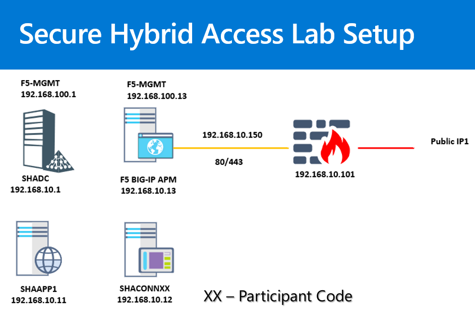

### **Lab 1: Publish a Header Based Application with F5 BIG IP APM and Azure AD**
##### **Objective** : 
We will publish a Header Based Application running Internally on the SHAAPP1 Web Server. The application can be accessed internally by using http://shaapp1:90/HeaderApp1

Below are the series of steps required.
##### **Part 1:** Identify the public IP Address
##### **Part 2:** Update the Internal and External DNS for the Application 
##### **Part 3:** Add Application in the Azure AD
##### **Part 4:** Publish and Configure BIG IP to Authenticate with Azure AD and Create Headers
##### **Part 5:** Verify Application Access Internally
##### **Part 6:** Verify Application Access Externally

**Pre-requisites**
Before we get started with the exercises there are few environment pre-requisites that will need to be installed and setup.

### Install the Application Sample
IIS
a. Login to SHAApp1 VM as wingtiptoys\administrator

b. Open Windows PowerShell ISE as Administrator

c. Copy the entire script from this URL 

https://raw.githubusercontent.com/jeevanbisht/Azure-ActiveDirectory-AppProxy-DemoSuite/master/BootStrap.ps1

### **Lab 2: Publish a Kerberos Application with F5 BIG IP APM and Azure AD**

**Objective**

We will publish a Kerberos Application using the Access Guided Configuration.

##### **Part 1:** Identify the public IP Address
##### **Part 2:** Update the Public DNS for the Application 
##### **Part 3:** Ensure the Web Application is using Kerberos
##### **Part 4:** Create a F5 Keberos Delegation Account
##### **Part 5:** Publish and Configure BIG IP to Authenticate with Azure AD
##### **Part 6:** Verify Application Access